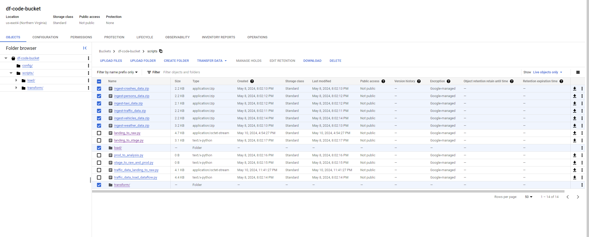
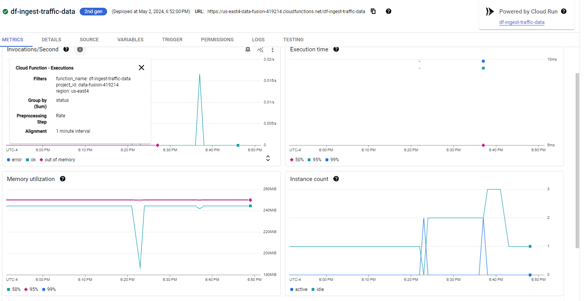
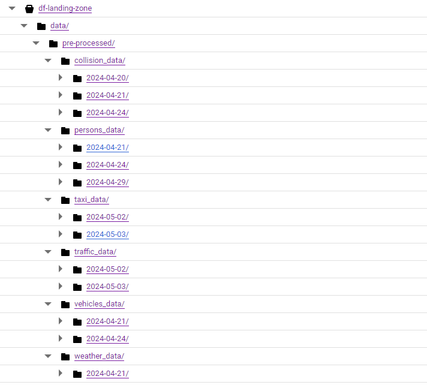
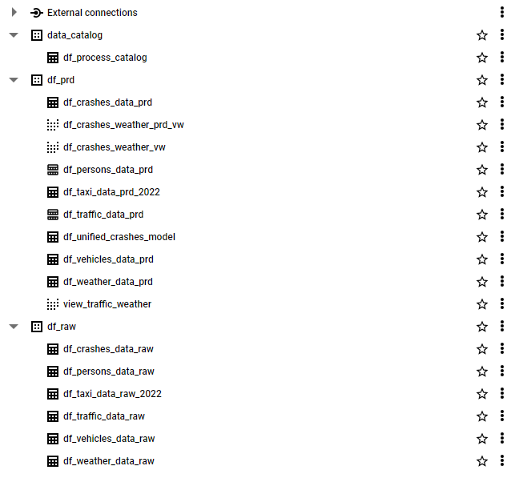
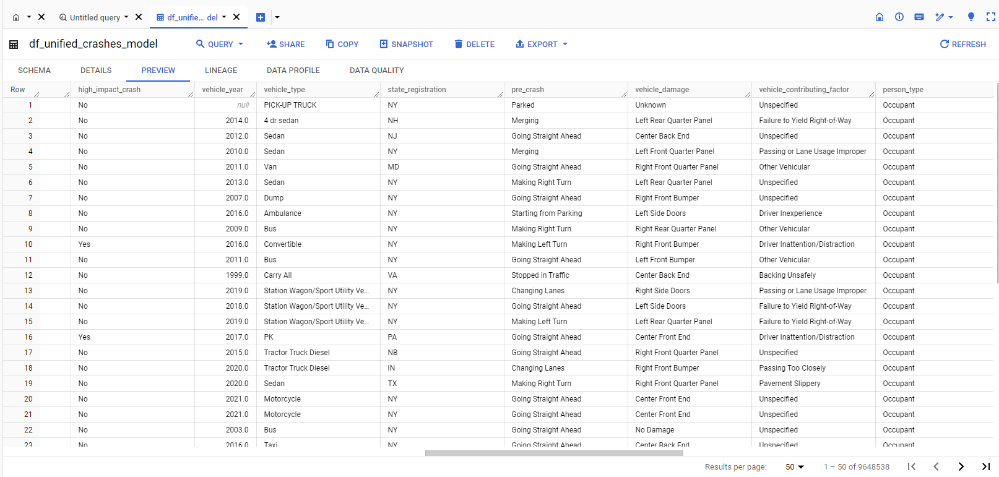

# Analyzing the Impact of Weather, Traffic, and Taxi Usage on Road Safety in NYC

```
    ____          __            ______              _             
   / __ \ ____ _ / /_ ____ _   / ____/__  __ _____ (_)____   ____ 
  / / / // __ `// __// __ `/  / /_   / / / // ___// // __ \ / __ \
 / /_/ // /_/ // /_ / /_/ /  / __/  / /_/ /(__  )/ // /_/ // / / /
/_____/ \__,_/ \__/ \__,_/  /_/     \__,_//____//_/ \____//_/ /_/ 

- In the storm of data, we fuse insights for safer paths.
```

## Table of Contents

- [Background](#background)
- [Data Architecture](#data-architecture)
- [Initial Setup](#initial-setup)
- [Ingest](#ingest)
- [Load and Transform](#load-and-transform)
- [Storage](#storage)
- [Analysis](#analysis)
- [Dashboard](#dashboard)
- [Key Takeaways](#key-takeaways)
- [Management](#management)


## Background

Understanding the dynamics of road safety in New York City is crucial for implementing effective traffic management strategies and ensuring public safety. This project integrates multiple datasets to analyze the relationship between weather, traffic, taxi usage, and road safety in NYC. The objective is to uncover patterns, correlations, and potential causal relationships that can inform stakeholders and aid in risk mitigation associated with adverse conditions.

### Business Problem

The interplay between weather conditions, traffic patterns, and taxi usage plays a significant role in road safety incidents. This project seeks to provide stakeholders with insights into these factors to potentially reduce risks and enhance public safety measures.

### Project Description

* This project aims to design a comprehensive data system that integrates multiple datasets to analyze the relationship between weather, traffic, taxi usage, and road safety in NYC. 
* The datasets utilized include DOT Traffic Speeds, Motor Vehicle Collisions (Persons), Motor Vehicle Collisions (Vehicles), weather data from OpenWeatherMap API, and TLC trip data from the NYC TLC Trip Records. 
* By merging these datasets, we seek to investigate how various weather conditions, traffic densities, and taxi activities impact road safety metrics such as the frequency and severity of motor vehicle collisions. 
* Through rigorous data analysis and visualization techniques, we aim to uncover patterns, correlations, and potential causal relationships.

### Datasets:
- DoT Traffic Speeds- https://data.cityofnewyork.us/Transportation/DOT-Traffic-Speeds-NBE/i4gi-tjb9/about_data
- Motor Vehicle Collisions (Persons) - https://data.cityofnewyork.us/Public-Safety/Motor-Vehicle-Collisions-Person/f55k-p6yu/about_data
- Motor Vehicle Collisions (Vehicles) - https://data.cityofnewyork.us/Public-Safety/Motor-Vehicle-Collisions-Vehicles/bm4k-52h4/about_data
- Motor Vehicle Collisions (Crashes) - https://data.cityofnewyork.us/Public-Safety/Motor-Vehicle-Collisions-Crashes/h9gi-nx95/about_data
- Weather Data -  https://open-meteo.com/
- TLC trip data - https://www.nyc.gov/site/tlc/about/tlc-trip-record-data.page

## Data Architecture


1. **Data Ingestion via Cloud Functions**:
   - **Triggering Cloud Functions**: Leveraging *event-driven architecture* and *serverless computing*, Cloud Functions are scheduled by Cloud Scheduler to fetch data from various external APIs (e.g., Weather Data, Crashes Data, Persons Data, Vehicles Data, Taxi Data, Traffic Data).
   - **Storing in Landing Zone**: Ingested data is stored as CSV or JSON files in a pre-processed path within the landing zone in Cloud Storage, implementing the *data lake* paradigm.

2. **Data Storage**:
   - **Landing to RAW**: Using *distributed computing* and *in-memory processing*, PySpark scripts which are stored in the GCS buckets are referenced by shell scripts in the Code Bucket, run transformation and loading jobs. This process is automated using `CRONTAB` file available on all Linux Distros.
   - **Raw Dataset Storage**: Processed data is stored in a raw dataset in Cloud Storage, maintaining the *schema-on-read* approach.

3. **Data Transformation and Loading**:
   - **RAW to Prod Dataset**: Transformed data is loaded from the raw dataset to the production dataset, implementing *ETL (Extract, Transform, Load)* processes. This process is automated using `CRONTAB` file available on all Linux Distros.

4. **Scheduling**: 
    - The cloud functions are scheduled by cloud schedulers to run every hour between 9AM to 5PM EST from Monday to Friday.
    - The LANDING to RAW shell script is scheduled by crontab and cron expressions on Compute Engine to run at 6 PM EST from Monday to Friday.
    - The RAW to PROD shell script is scheduled by crontab and cron expressions on Compute Engine to run at 7 PM EST from Monday to Friday.

5. **Data Monitoring and Management**:
   - **Data Catalog**: Utilizing *metadata management* and *data governance*, the Data Catalog monitors processes, tracks last fetched timestamps for incremental loading, and ensures data quality and consistency.

6. **Data Visualization**:
   - We leveraged open-source `Apache Superset` installing it on compute engine and local systems, to create dashboards and charts, which are auto-refreshed at periodic intervals.

## Initial Setup

**Setup and Execution:**
- Make the script executable: 
```
chmod +x setup.sh
```
- Run the script: 
```
./setup.sh <GCP-PROJECT-ID> <GCP-SERVICE-ACCOUNT-NAME>
```

**Script Operations:**

**Initial Setup and Installation:**
- Takes two arguments: GCP project ID and service account name.
- Installs `jq` for handling JSON files on Ubuntu or WSL.
- Validates and installs `gcloud` CLI if not already installed.

**Google Cloud Authentication and Configuration:**
- Establishes service accounts and sets up default credentials.
- Creates a new service account with necessary permissions.
- Reuses previously generated credentials if the script is rerun.

**Environment Setup for Development:**
- Ensures Python and `virtualenv` are installed.
- Installs required Python libraries from `requirements.txt`.

**Infrastructure Setup and Management:**
- Automates creation of BigQuery datasets, tables, and GCS buckets.
- Generates an unique global configuration and uploads Cloud Functions code to GCS.
- Ensures Terraform is installed for infrastructure as code deployments.
- Exports necessary environment variables for Terraform.

**Resource Management:**
- Optionally clears existing resources for a clean state.
- Executes Terraform scripts to create cloud functions and schedulers for APIs.

**Cleanup and Configuration Management:**
- Removes configuration files from ingest location for security.
- Persists Terraform variables in the bash environment.


|:--:|
| Setting up the Infrastructure using the Setup Script |


|:--:|
| Installing System Dependencies |


|:--:|
| Cloud Functions Creation |


|:--:|
| Cloud Functions Fully Set Up |


|:--:|
| Cloud Schedulers are Fully Set Up |


|:--:|
| Contents Inside Code Bucket |

## Ingest

These scripts are designed to run as a Google Cloud Function that automates the process of ingesting data from the APIs, processing it, and storing the results in Google Cloud Storage and BigQuery.

1. **Initialization**: The script begins by importing necessary libraries and loading configuration details from a JSON file. It initializes Google Cloud Storage and BigQuery clients and sets up constants for the process.

2. **Fetch Last Offset**: The `fetch_last_offset` function queries BigQuery to determine the most recent timestamp of successfully processed data, which helps in fetching new data incrementally from the API.

3. **Date Handling**: The `get_dates` function converts the retrieved timestamp into start and end dates for data extraction, ensuring that data is fetched in defined time increments (60 days by default).

4. **Data Fetching and Uploading**: The `fetch_data` function constructs an API call to retrieve crash data within the specified date range, while `upload_to_gcs` uploads the fetched data as a CSV file to Google Cloud Storage, handling potential errors gracefully.

5. **State Management and Execution**: The main `execute` function coordinates the entire process, from fetching data to uploading it, and storing the function's state in BigQuery. It captures the execution state, timestamps, and logs any errors, ensuring robust and trackable data processing.

6. **Scheduling**: 

   - The functions each run in response to an HTTPS trigger provided by the cloud scheduler. We decided to set the schedule interval to 9AM to 5PM Monday to Friday EST, meaning each cloud function gets triggered at least 8 times a day. Depending upon the size of the dataset, we calculated the number of executions necessary and scheduled them at the said intervals. 

   - For e.g. while fetching traffic data, even a month worth of data in flat file format overwhelmed the initial 2GB cloud function memory, prompting us to reduce the number of days fetched at once from 30 to 15 and increasing the number of executions per hour. 
   
   - One can further customize the data pulled by calculating the number of executions from the start_date to current_date, divide it by `DAY_DELTA` variable in the traffic_data [cloud function](./ingest/traffic_data/main.py)


|:--:|
| Created GCS Cloud Buckets |


|:--:|
| One of the cloud functions (traffic data) executing |


|:--:|
| Showcasing how data is organized in the landing bucket |

## Load and Transform

Data from all sources is transformed into a cohesive data model using DataProc and PySpark. The transformation occurs bi-hourly, dovetailing with the ingest timing to ensure a balance between data freshness and system efficiency. During this stage, data is prepared for analysis, conforming to a relational schema that supports complex queries.

### Load Script: [crashes_data](./load/load_crashes_data_pyspark.py)

**1. Configurable Data Ingestion:**
   - The script utilizes `argparse` to accept command-line parameters, allowing the configuration of batch sizes and file prefix paths for selective data processing. 
   - This flexibility supports different operational needs and data volumes.

**2. Batch Processing of Files:**
   - Files from Google Cloud Storage are listed and batched based on size, a process that ensures efficient memory management and system performance during data loads. 
   - The script batches files up to a specified gigabyte limit, preparing them for sequential processing.

**3. Spark Session**
   - A Spark session is initialized with necessary configurations, including dependencies for integrating Spark with BigQuery. 
   - This session facilitates the distributed processing of data, crucial for handling large datasets efficiently.

**4. Data Transformation and Type Casting:**
   - Before loading to BigQuery, the data undergoes transformations where necessary columns are cast to appropriate data types (e.g., integers and timestamps), ensuring data integrity and compatibility with the target schema in BigQuery.

**5. Efficient Data Loading to BigQuery:**
   - Transformed data is loaded into BigQuery using Spark’s BigQuery connector, which allows direct data writing from Spark DataFrames to BigQuery tables, optimizing the load process and maintaining data consistency.

### Transformation Script: [crashes_data](./transform/transform_crashes_data.py)

**1. Data Cleaning and Null Handling:**
   - The script includes a function to replace null values in string columns with a default text ('Unknown'), standardizing the data for analysis and preventing issues related to missing data during analytical processes.

**2. Data Enrichment with Date and Time Features:**
   - Additional columns related to time (year, month, day) are derived from the `crash_date` to facilitate time-based analysis. 
   - This transformation enables more detailed insights into trends and patterns over time.

**3. Calculation of Additional Metrics:**
   - New metrics such as `was_fatal` (indicating if the crash was fatal) and `total_vehicles_involved` (summing vehicles involved) are calculated, enhancing the dataset with derived attributes that support more nuanced analyses.

**4. Handling Categorical Data:**
   - The script ensures that vehicle involvement is quantified, transforming categorical vehicle type data into numerical indicators (0 or 1) for each vehicle involved. This transformation is crucial for subsequent analytical models that require numerical input.

**5. Optimized Data Storage in BigQuery:**
   - The transformed dataset is written to BigQuery, partitioned by `year` and `month` to optimize query performance and cost-efficiency. Partitioning helps in managing and querying large datasets by limiting the data scanned during queries.

### Scheduling and Job execution
This step is handled by 2 shell scripts.

#### Loading [Shell Script](./run_load_to_raw.sh) Explanation

**1. Scheduled Execution:**
   - The loading shell script is scheduled to run daily at 6 PM on weekdays, leveraging crontab for automation. 
   - This ensures that data loading operations are performed consistently outside of peak hours to minimize system load during high-traffic periods.

**2. Environment Setup and Dependency Management:**
   - Before executing, the script checks and sets necessary environment variables, such as the Google Cloud project ID. This must have been handled in the initial setup prior to this execution.
   - It also configures paths to necessary configuration files and buckets, ensuring that all operations are executed within the correct project and data environment.

**3. Cluster Management:**
   - The script manages the lifecycle of a Dataproc cluster, starting and stopping it as needed. 
   - This efficient management of resources helps control costs and improves performance by ensuring that the cluster is only running when necessary.

**4. Data Loading Operations:**
   - It performs data loads through a series of PySpark jobs for different datasets (traffic, taxi, crashes data). 
   - Each job is submitted to the Dataproc cluster, handling large datasets effectively using Spark’s distributed computing capabilities.

**5. Direct Data Loads:**
   - For certain datasets like weather, persons, and vehicles data, the script uses a Python script for direct loading into BigQuery, showcasing a flexible approach to data handling and ingestion depending on the data type and source.

#### Transformation [Shell Script](./run_transformations.sh) Explanation

**1. Scheduled Transformation Jobs:**
   - The transformation script is set to run daily at 7 PM on weekdays, scheduled via crontab. 
   - This timing ensures that all data loaded during the previous hour is promptly transformed, maintaining data freshness and readiness for analysis.

**2. Cluster Startup and Job Submission:**
   - Similar to the load script, this script handles starting the Dataproc cluster and submits multiple PySpark jobs for transforming various data types (persons, crashes, vehicles, traffic, weather).
   - Each transformation script is tailored to specific data needs, enhancing data quality and structure for analytical uses.

**3. Job Monitoring and Management:**
   - Each PySpark job is identified with a unique job ID, which facilitates monitoring and managing jobs in the Dataproc cluster.
   - This level of detail in job management aids in troubleshooting and provides clear traceability for operations performed on the data.

**4. Resource Optimization:**
   - The script ensures the cluster is run only when needed and stopping it post-transformation, which is crucial for managing costs and resource consumption in cloud environments.

**5. Detailed Logging and Output:**
   - Throughout the script, detailed logs are provided for each step, from cluster management to job submission.

`Note` - TThe screenshots below illustrate the cluster creation and job execution processes during some of our initial runs. These were a part of an experimental phase where we explored a menu-driven approach for our shell scripts. We aimed to demonstrate how this method aligns with our scheduled operations. Unfortunately, we had to repeat the ingestion process, which incurred additional costs. This necessity arose from our desire to refine the process to ensure optimal performance and cost-efficiency in a production environment.


|:--:|
| DataProc Cluster Set Up --- Configuration --- Leader Node: 1 N2-Standard-4 4CPU 16GB --- 2 Worker Nodes: 2 E2-Standard-4 4VCPU 16GB|


|:--:|
| Virtual Environment (Compute Engine) Set Up |


|:--:|
| Creating DataProc Jobs |


|:--:|
| We intended to run "Landing Zone to Raw Zone Script" also on Virtual Machine (Compute Engine) using a CRON expression |


|:--:|
| We inteded to run the "Transformation Script" on Virtual Machine (Compute Engine) using CRON expression |


|:--:|
| Transformation Job Successful on Virtual Machine (Compute Engine) |


|:--:|
| Running "Landing Zone to Raw Zone Script" on the Local Environment (Command Line) |


| Running "Transformation Script" on the Local Environment (Command Line) |


|:--:|
| PySpark Job Creation |


|:--:|
| PySpark Job Execution Details |


## Storage

### **Landing Zone Cloud Storage Bucket**:

- **Initial Data Ingestion**: Raw data from various sources is directly stored into the cloud storage bucket upon ingestion. This includes dedicated folders for each data type such as crashes, persons, and traffic, which are organized date-wise folder to enhance manageability and accessibility.

- **Pre-Processed Data Organization**: Data within the `pre-processed` folder of the landing bucket is segmented into daily batches, allowing for systematic tracking and management. 

- **Post-Processing and Optimization**: After undergoing necessary preprocessing, data is transitioned to the `processed` folder within the same bucket in parquet format.

### **BigQuery Data Organization**:

- **Logical Structure and Data Model Representation**:
   - Our BigQuery setup is meticulously structured to logically represent the data models, facilitating seamless integration with DataProc and supporting robust SQL querying capabilities on large datasets.
   
   - **Raw Dataset** (`df_raw`):
     - Contains unprocessed, raw data directly from ingestion, serving as the foundational layer for all transformations. Specific datasets include:
       - `df_crashes_data_raw`: Details on traffic crashes.
       - `df_persons_data_raw`: Information on individuals involved in incidents.
       - `df_taxi_data_raw`: Data from TLC concerning taxi trips.
       - `df_traffic_data_raw`: Traffic flow and congestion data.
       - `df_vehicles_data_raw`: Information on vehicles involved in crashes.
       - `df_weather_data_raw`: Weather conditions affecting city dynamics.
   
   - **Production Dataset** (`df_prd`):
     - Hosts transformed and cleansed data, ready for in-depth analysis and reporting:
       - `df_crashes_data_prd`: Analytical-ready crashes data.
       - `df_persons_data_prd`: Curated data on persons involved.
       - `df_taxi_data_prd`: Insights into taxi service usage.
       - `df_traffic_data_prd`: Traffic analysis-ready data.
       - `df_vehicles_data_prd`: Data on vehicles, post-transformation.
       - `df_weather_data_prd`: Weather data for advanced analytics.
   
   - **Data Catalog** (`df_catalog`):
     - Maintains `df_process_catalog`, crucial for managing metadata and ensuring data governance across the process lifecycle.

### **Automation and Data Handling**:
   - Python scripts are used for straightforward data loads directly into BigQuery for datasets like weather, vehicles, and persons, optimizing the load process.

   - PySpark scripts are crucial for handling datatype transformations and more complex data manipulations, especially for datasets like traffic data that originated in JSON format and required extensive processing. 

   - Our evaluation of Apache Beam versus Apache Spark for these tasks led us to choose Spark due to its superior performance in batch processing environments.
   


|:--:|
| Data Storage in the Landing Zone (Pre-Processed) |


|:--:|
| Moving the file from Landing Zone (Pre-Processed) to (Processed) |


|:--:|
| BigQuery Tables structured in raw and production datasets |


|:--:|
| Unified Crash Data Table Preview |

## Analysis

The combined data model is housed in the [combined_data_model](./analyze/combined_data_model.sql) file under the [analyze](./analyze/) section of the repository and contains the SQL query developed to frame this combined model.

### Combined Data Model

- The `df_unified_crashes_model` table aggregates crash data, persons data, and vehicles data into a unified schema.
- This includes specific transformations for data normalization and consolidation.

### Data Standardization
- In constructing the df_unified_crashes_model, we have created a robust data model that integrates and standardizes various datasets to provide a comprehensive view of vehicle crashes across New York City. 

- This model standardizes borough names to ensure consistency across datasets, facilitating accurate city-wide analyses.  

- Furthermore, the creation of additional views linking this unified crashes model to weather, traffic, and taxi data extends its utility, enabling complex queries that can assess the impact of environmental and traffic conditions on crash events. 

----

### In-Depth Analytics Performed

The SQL scripts housed in the [analytical_queries](./analyze/analytical_queries.sql) file of the repository provides in-depth SQL queries to find the answers to our analytical questions with a further scope provided by the [potential_queries](./analyze/potential_analysis.sql) file.

#### Weather Statistics of NYC
- **Question:** What are the average weather conditions in each borough of NYC between 2009 and 2024?
- **Answer:** The top section of the dashboard provides weather statistics across different boroughs, including temperature range, snowfall, rainfall, and humidity for the specified period.

#### Fatality in High Impact Crashes
- **Question:** How has the fatality rate in high impact crashes varied across different boroughs from 2016 to 2024?
- **Answer:** The line graph under the "Fatality in High Impact Crashes" section shows a trend of fatalities in high impact crashes across various boroughs, indicating a general decrease over the years.

#### Vehicles Involved in a Crash Year Over Year (YOY)
- **Question:** What is the year-over-year change in the number of vehicles involved in crashes?
- **Answer:** The "Number of Persons Killed YoY" graph also shows the number of vehicles involved in crashes, with a trend line illustrating yearly variations.

#### Fatal Crashes in Weather Conditions
- **Question:** How do weather conditions like rain, snow, and fog correlate with the incidence of fatal crashes?
- **Answer:** The colorful donut chart titled "Fatal Crashes in Weather Conditions" visually represents the correlation between different weather conditions and fatal crashes.

#### Body Injury and Status Post Crash
- **Question:** What patterns exist between the type of bodily injuries, emotional status, and age groups of crash victims?
- **Answer:** The network graph titled "Body Injury and Status Post Crash" visualizes the relationships between bodily injuries, emotional statuses, and age categories of individuals involved in crashes.

#### High Yielding Factors of Crashes
- **Question:** What are the top five contributing factors to crashes in the past five years?
- **Answer:** The diagram lists "High Yielding Factors of Crashes" like aggressive driving, failure to yield right-of-way, and driver inattention/distraction, showing their relative frequencies.

#### Number of Persons Killed YoY
- **Question:** What is the trend in the number of persons killed in vehicle crashes from year to year in each borough?
- **Answer:** The green line graph displays the year-over-year count of persons killed in crashes across different boroughs, showing a slight increase in recent months.

#### Occurrence of High Impact Crashes
- **Question:** How does the monthly occurrence of high impact crashes fluctuate from 2016 to 2024?
- **Answer:** A significant numeric display indicates "46 high impact crashes in May 2024," noting a dramatic 94.6% decrease over the past 12 months.

#### Number of Persons Injured
- **Question:** What is the monthly trend in the number of persons injured in crashes from 2012 to 2024?
- **Answer:** A similar green line graph to the fatalities shows the monthly count of persons injured in crashes from 2012 to 2024, noting an 8.1% increase in the last 12 months.

#### Contributing Factor for Crashes while Turning
- **Question:** What are the most common contributing factors for crashes that occur during turning maneuvers?
- **Answer:** The large number "47,557" under "High Impact Crashes While Turning" identifies the number of crashes that occurred during turning maneuvers.

#### Categorizing Persons Involved in Crashes
- **Question:** How are the demographics (such as age and person type) distributed among those involved in crashes?
- **Answer:** A bar graph categorizes individuals involved in crashes by their person type and age category, highlighting predominant age groups and person types.

#### Analyzing Traffic Speeds in NYC on Weekdays and Weekends
- **Question:** What are the differences in average traffic speeds between weekdays and weekends in NYC?
- **Answer:** The area graph titled "Traffic Speed in NYC on Weekdays and Weekends" analyzes differences in traffic speeds, clearly indicating variations between these times.

#### Trend of High Impact Crashes YoY
- **Question:** Is there a noticeable trend in high impact crashes year over year across different boroughs?
- **Answer:** A graph shows the yearly trend of high impact crashes across different boroughs, with some peaks and valleys over the years.

#### Understanding Pre Crash Condition and Vehicle Damage Afterwards
- **Question:** Is there a correlation between pre-crash conditions and the severity of vehicle damage following a crash?
- **Answer:** The circular network graph at the bottom of the dashboard could suggest the relationship between pre-crash conditions and the extent of vehicle damage following a crash.

#### State-wise Distribution of Crashes
- **Question:** How are high impact crashes distributed across different states based on vehicle registration from 2023 to 2024?
- **Answer:** A pie chart shows the state-wise distribution of high impact crashes, focusing on the state of vehicle registration from 2023 to 2024.

## Dashboard
Here is a dashboard that we developed using Apache Superset based on the queries above. We decided to go with Superset because of it's advanced visualizations, ease of use, better flexibility over Looker. 


## Key Takeaways

- **Portability**: This project is designed to be portable and used on any Ubuntu platform; it can be your local machine or a compute engine, the setup is initialized in a way that it connects to the GCP resources seamlessly.
- **BigQuery**: Enabled powerful and scalable analytics on large datasets. Also, seamlessly allowed us to perform direct load operations for some of the datasets, saving time.
- **Cloud Storage**: Provided secure and durable storage for our data without incurring a lot of cost.
- **DataProc**: Facilitated efficient data processing with SPARK and also provided a JUPYTERLAB interface to perform some quick testing off the shelf.
- **Cloud Functions**: Managed serverless operations helped us to extract data from the APIs as quickly as possible.
- **Cloud Schedulers**: Automated our cloud functions to run once every hour on weekdays between 9 to 5.
- **Opting for Simplicity in Scheduling**: Initially, we considered using Cloud Composer to orchestrate raw and prod loading. However, we realized that for our project's scale and complexity, Shell Scripts and Crontabs provided a more straightforward and equally effective solution. This approach allowed for precise control and scheduling flexibility without the overhead of managing an additional orchestration tool.

- **Intelligent Data Batching**: To manage system resources efficiently and avoid overloading, we implemented intelligent data batching in chunks of 2-3 GB. This strategy ensured smooth and uninterrupted data processing.

- **Choosing PySpark Over BEAM**: We opted for PySpark over BEAM due to its superior in-memory processing speed, which significantly boosted our data handling capabilities, especially when processing large JSON files. BEAM could be a better option if we intended to use a streaming data source, but for batch workloads, SPARK reigns supreme.

- **Data Cataloging Improvement**: We noticed frequent timeouts with traffic data despite a 600-second timeout limit. This was due to inefficient paging and fetching offsets from the API. By modifying our ingestion code to fetch data based on timestamps (30-40 days at a time), we improved our system's performance and successfully fetched high volumes of data. Here are the stats for our processes:

  1. `ingest-traffic-data`: 95.71 seconds
  2. `ingest-vehicles-data`: 51.30 seconds
  3. `ingest-persons-data`: 28.48 seconds
  4. `ingest-crashes-data`: 8.55 seconds
  5. `ingest-taxi-data`: 6.22 seconds
  6. `ingest-weather-data`: 3.31 seconds

- **Holistic Data Integration**: By integrating diverse datasets — weather, traffic, taxi, and crash data — we were able to gain comprehensive insights into the factors influencing road safety in NYC. This integration helped us uncover important trends and correlations.

- **Insightful Visualizations with Dynamic Dashboards**: We leveraged Superset to create dynamic dashboards primarily due to its ease of features and quick integration with Bigquery. This allowed us to build a pretty dashboard for our MBA friends to get wowed about.

## Management
- Our GitHub repository follows best practices for python modules including adhering to PEP-8 conventions, docstrings, and comments.
- Commits are small, logical, and contain clear messages. 
- All team members contribute meaningful commits.
- Code is organized into folders that correspond to each project dimension (Ingest, Transformation, Storage, Analysis).